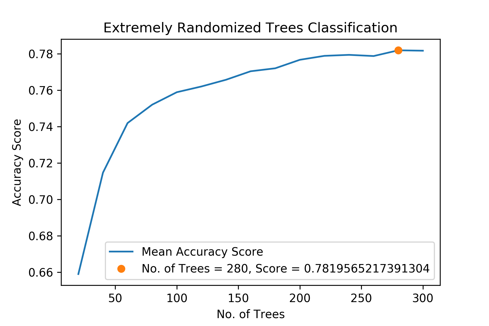
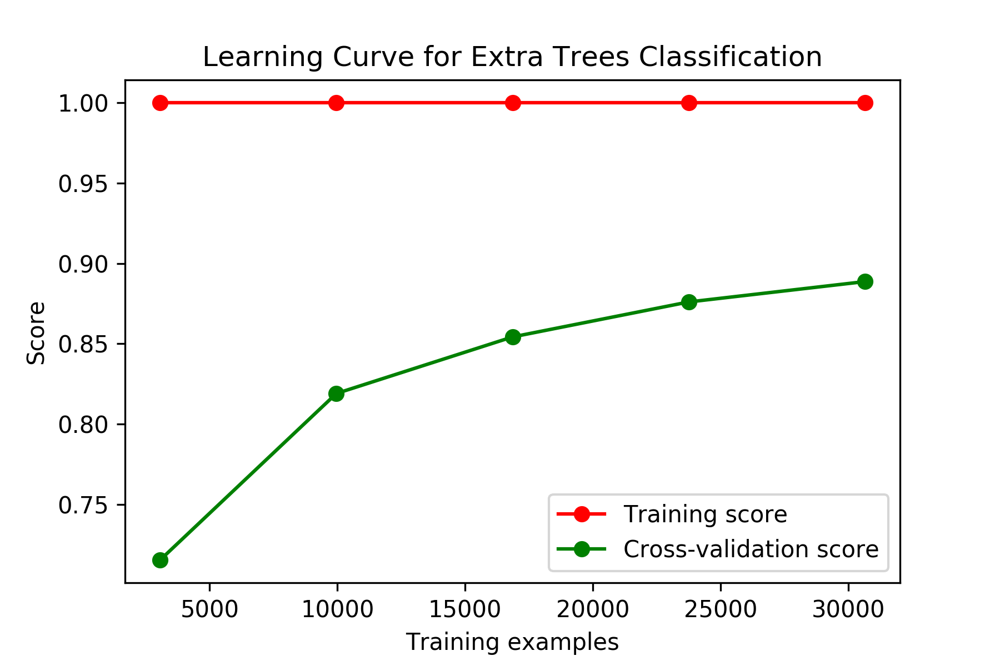

# Devanagari Script Character Recognition Using Machine Learning

## Introduction

This is a Character Recognition System which I developed for Devanagari Script. The learning model was trained on 92 thousand images (32x32 pixels) of 46 characters, digits 0 to 9 and consonants “ka” to “gya”. The optimal result, 92% accuracy, was obtained using Extremely Randomized Decision Forest Classification algorithm.

## What is Devanagari?

Devanagari is an Indic script and forms a basis for over 100 languages spoken in India and Nepal including Hindi, Marathi, Sanskrit, and Maithili. It comprises of 47 primary alphabets, 14 vowels, and 33 consonants, and 10 digits. In addition, the alphabets are modified when a vowel is added to a consonant. There is no capitalization of alphabets, unlike Latin languages.

## [Technical] Project Walkthrough

A sample of the dataset is analyzed using various algorithms, and their scores and computational costs are compared.

| Algorithm              | Accuracy (in percent) | Total Time (in seconds) |
| -----------------------|----------------------:| -----------------------:|
| RidgeClassifier        | 42.3384               | 00.712410               |
| BernoulliNB            | 51.2742               | 00.168973               |
| GaussianNB             | 39.6972               | 01.411730               |
| ExtraTreeClassifier    | 31.1093               | 00.109071               |
| DecisionTreeClassifier | 36.5119               | 04.080331               |
| NearestCentroid        | 53.0247               | 00.127525               |
| KNeighborsClassifier   | 72.1442               | 36.413726               |
| ExtraTreesClassifier   | 57.4804               | 00.563712               |
| RandomForestClassifier | 54.3047               | 00.932044               |

Using the above table, K Nearest Neighbors Classification, Extremely Randomized Decision Forest Classification and Random Forest Classification algorithm are selected. A Grid Search is performed to obtain optimum parameters and scores of these algorithms and compare their performance.

Learning Curve for Extra Trees Classification algorithm was plotted.

## Conclusions

The final result, using Extremely Randomized Decision Forest Classification Algorithm with 256 trees gives an accuracy score of 92%.